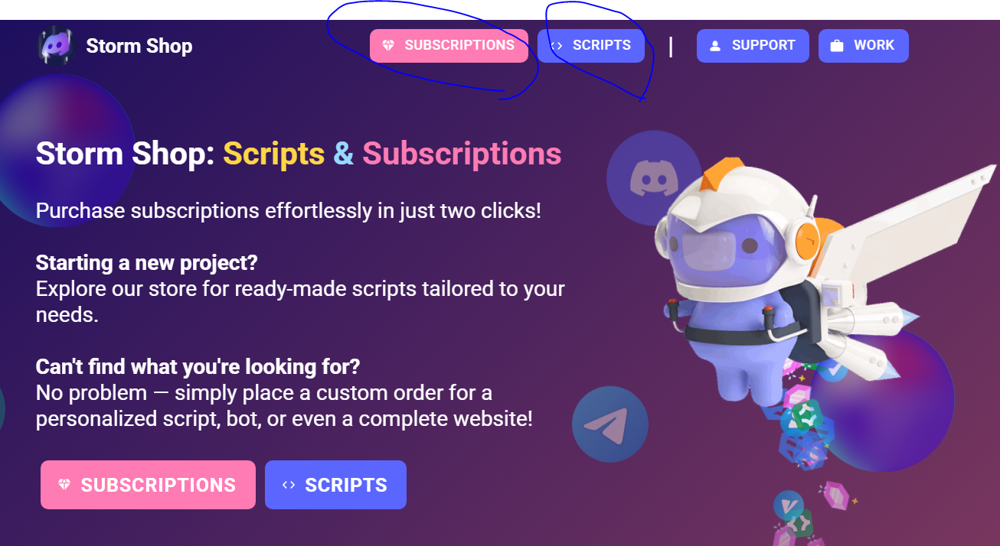

This App is currently in Development!

# What StormShop is ...

StormShop is a project that sells scripts and subscriptions (mostly for Russian users).
You can buy it on our [website](https://nitro-storm.ru) / [telegram bot](https://t.me/storm_nitro_shop_bot) / [discord server](https://discord.gg/BNsV86yGQA) ... etc.

What about scripts? You can easily buy them on our [website](https://nitro-storm.ru). After purchasing you get the archive and README.md file with all instructions. If you wish, we can add you into private GitHub repository with the script you purchased!

# How to Install

```
git clone https://tailormind-design-studio-admin@bitbucket.org/tailormind-design-studio/storm-shop.git

npm install

npm start
```

# Basic Technical Test



1. Remove Subscripts and Scripts Buttons from header
2. Instead, add `Create Account` and `Login Account` buttons

In order to submit your test, create a github repository and push all your changes to this repository and share the repository link with your recruiter.

# Updates for Submission

This repository is a forked version of the original assessment repo with my completed changes.
This section documents the changes made as part of the technical assessment.
The original README instructions remain unchanged above for reference.

# Repository Setup

Clone this updated repository instead of the original:

```
git clone https://github.com/um9r/storm-shop-assessment.git

npm install

npm start
```

# Changes Implemented

1. Removed Subscriptions and Scripts buttons from the header.

2. Added Create Account and Login buttons in their place.